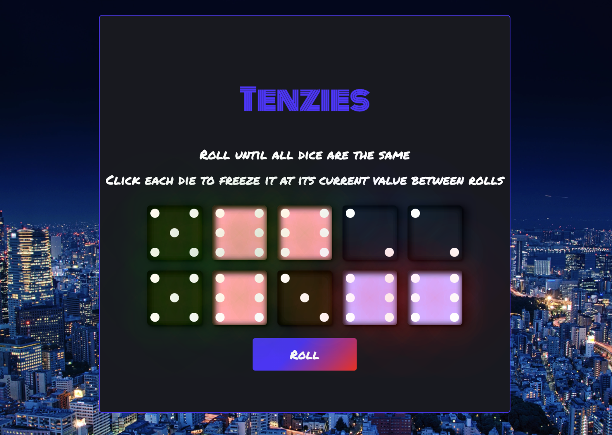

# Tenzies


:rocket: **Deployed** with GitHub pages https://pilks-pixel.github.io/Tenzies-game/


## About

Dice game built with React, demonstrating my knowledge state through hooks and props. I have also made use of ccs flexbox & grid when constructing the dice elements.


## Instructions
Clone down to local machine, `npm install` and `cd game`  

`npm start` to run in the development mode.

Open [http://localhost:3000](http://localhost:3000) to view it in your browser.


## Wins
-[x] Made use of **useState** & **useEffect** hooks to manage individual states of each dice between rolls.

-[x] Created dice faces using css with neon effect.

-[x] Sound effects added with **Uifx** dependency.


## Future features
-[] Dice rolls count.

-[] Highscores page with database used for persistance.


## Significant code
```javascript

// Checks if all the dice are Equal and Held to determine if the game is won

  useEffect(() => {

    const allHeld = dice.every(die => die.isHeld)
    const allEqual = dice.every((die, index, arr)=> {
     return index === 0 || die.value === arr[index - 1].value? true :
     false;
    })

    if (allHeld && allEqual) setTenzies(prevTenzies => !prevTenzies) 
  
  },[dice])
  ```